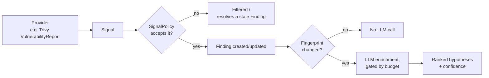

# Architecture

## Interaction surfaces

Candor has no web UI, by design — a bespoke UI tends to pull a project toward a multi-service
platform, which is complexity this project deliberately avoids. You interact with it the way you
already interact with Kubernetes:

- **`Finding` CRD status** — the primary surface. `kubectl get findings`.
- **Prometheus `/metrics`** — findings raised/suppressed/verified/recurred, LLM calls, spend vs.
  budget, degraded state.
- **Kubernetes Events** — picked up by whatever event exporter is already in your cluster.
- **A Grafana dashboard**, shipped in the Helm chart. Not decoration — for a tool whose pitch is
  publishing its own accuracy, the dashboard *is* the proof surface.
- **A generic webhook sink** — one code path, one JSON payload shape, covers Slack, Teams,
  PagerDuty, or anything else that can receive a POST. No per-vendor SDKs to maintain.
- **A periodic digest report** over that same webhook sink — findings raised/resolved/recurred,
  accuracy, spend vs. budget. The artifact the *"AIOps: Prove It!"* critique asks for.

## How a signal becomes a Finding

- **Signal providers** — a Go interface normalizing heterogeneous input into a common `Signal`.
  Ships with Trivy `VulnerabilityReport` CRs; a generic webhook receiver and additional providers
  (Falco, Alertmanager) slot in later without changing the core.
- **The fingerprint + budget layer** sits between signals and the model. This is the load-bearing
  differentiator — nothing reaches the LLM without passing through it. A content-addressed hash
  of the signal's meaningful fields gates enrichment: unchanged content is never re-enriched, no
  matter how many times a reconcile loop runs against it.
- **The LLM abstraction** is a pluggable interface (`internal/llm.Client`). Anthropic, using
  [structured outputs](https://platform.claude.com/docs/en/build-with-claude/structured-outputs)
  for grammar-constrained JSON, is the only implementation today.
- **The action catalog** is fixed and enumerated — the model's output can never select a
  free-form action, only one from this closed set. `Notify` (a generic webhook) ships today;
  `ProposePullRequest` (against your GitOps repo) is next.

## CRDs

| CRD | Purpose |
|---|---|
| `SignalPolicy` | Opts a namespace into a provider at a minimum severity; optionally sets a budget ceiling and a webhook. |
| `Finding` | One per fingerprint — severity, summary, ranked hypotheses with confidence, and a verification outcome. |
| `Suppression` | Mutes one exact `Finding` fingerprint, with a required reason and optional expiry. |

API group: `candor.dev/v1alpha1`.

## Verification, not assertion

Every claim above is backed by a test that runs against a real Kubernetes control plane
(`envtest`), not a mocked one:

- **Cost regression test** — N reconciles over unchanged state produce exactly **one** LLM call.
  Enforced on every PR, not asserted in a README.
- **Verification-outcome tests** — a signal whose source resolves, then recurs, produces the
  correct outcome transitions end to end.
- **Prompt-injection test** — a crafted malicious value in scanner data must not alter the
  selected action.

[Full design doc, evidence base, and delivery history :material-arrow-right:](https://github.com/teerakarna/candor/blob/main/docs/design.md){ .md-button .md-button--primary }
